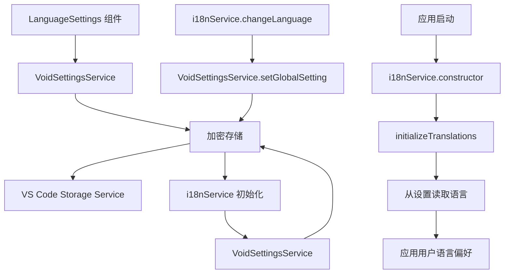

# Design Document

## Overview

本设计文档详细说明语言设置持久化功能的实现方案。该功能将修复当前用户在设置页面中选择语言后，关闭再次打开会复位成默认语言的问题。通过扩展现有的 i18nService 与 Void 设置系统的集成，实现用户语言偏好的持久化保存和自动恢复。

## Steering Document Alignment

### Technical Standards (tech.md)

本设计严格遵循 Void 项目的技术标准：

- **TypeScript 严格模式**：所有新代码将使用严格的 TypeScript 类型定义
- **依赖注入模式**：使用 VS Code 的依赖注入系统，确保服务间的松耦合
- **单一职责原则**：每个服务和方法都有明确的单一职责
- **错误处理模式**：遵循现有的错误处理和日志记录模式
- **异步操作模式**：使用 Promise 和 async/await 处理异步操作

### Project Structure (structure.md)

实现将遵循现有的项目结构：

- **服务层**：在 `common/` 目录中扩展现有的 i18nService
- **类型定义**：在相应的类型文件中定义必要的接口
- **UI 层**：保持现有的 LanguageSettings 组件结构不变
- **模块化设计**：确保功能可以被独立测试和维护

## Code Reuse Analysis

基于对现有代码的深入分析，本功能将大量重用现有组件和服务：

### Existing Components to Leverage

- **VoidSettingsService**:
  - 已完善的加密存储机制（`_storeState()` 和 `_readState()`）
  - `setGlobalSetting()` 方法用于保存语言设置
  - `state.globalSettings.language` 字段已存在于 GlobalSettings 类型中

- **I18nServiceImpl**:
  - 现有的 `changeLanguage()` 方法和事件机制
  - 翻译加载和管理逻辑
  - 事件通知系统（`onDidChangeLanguage`）

- **LanguageSettings 组件**:
  - UI 逻辑已经正确实现，保存和读取逻辑完善
  - 与 VoidSettingsService 的集成已经正常工作

### Integration Points

- **VS Code 存储系统**:
  - 使用现有的 `IStorageService` 接口
  - 利用现有的加密存储机制
  - 遵循现有的存储键命名约定

- **Void 设置系统**:
  - 集成到现有的全局设置管理流程
  - 利用现有的设置变更通知机制
  - 保持与其他设置的一致性

## Architecture

### 设计原则

本实现采用**最小侵入性修改**的原则，通过扩展现有服务而非重写来解决问题：

1. **保持向后兼容**：不破坏现有的 API 和组件接口
2. **最小修改范围**：仅修改 i18nService 的初始化逻辑
3. **复用现有机制**：充分利用现有的存储和通知系统
4. **遵循现有模式**：使用与其他设置相同的持久化模式

### 核心架构



### 数据流程

1. **设置保存流程**：
   ```
   LanguageSettings 组件 → voidSettingsService.setGlobalSetting('language', newLanguage)
   → _storeState() → 加密存储 → VS Code Storage
   ```

2. **语言恢复流程**：
   ```
   应用启动 → i18nService 初始化 → initializeTranslations()
   → voidSettingsService.state.globalSettings.language → changeLanguage()
   → 触发语言变更事件 → UI 更新
   ```

## Components and Interfaces

### Component 1: 扩展的 I18nServiceImpl

- **Purpose:** 在现有的 i18nService 基础上增加从设置中恢复语言偏好的功能
- **Interfaces:**
  - 保留现有的所有公共接口不变
  - 新增内部方法 `_loadLanguageFromSettings()`
- **Dependencies:**
  - `IVoidSettingsService` (通过依赖注入获取)
  - 现有的翻译数据和事件系统
- **Reuses:**
  - 现有的 `changeLanguage()` 方法
  - 现有的事件通知机制
  - 现有的翻译加载逻辑

### Component 2: 服务依赖注入

- **Purpose:** 为 i18nService 提供对 VoidSettingsService 的访问
- **Interfaces:**
  - 修改 i18nService 的构造函数以接受 IVoidSettingsService 参数
  - 使用 VS Code 的服务注册机制
- **Dependencies:**
  - VS Code 的依赖注入容器
  - IVoidSettingsService 接口
- **Reuses:**
  - 现有的服务注册模式
  - 现有的依赖注入配置

## Data Models

### Language Settings Model
```typescript
// 已存在于 GlobalSettings 中
interface GlobalSettings {
  // ... 其他设置
  language?: SupportedLanguage; // 'en-US' | 'zh-CN'
  // ... 其他设置
}

// SupportedLanguage 类型已存在
type SupportedLanguage = 'en-US' | 'zh-CN';
```

### Service Integration Model
```typescript
// 扩展的 I18nServiceImpl 构造函数
class I18nServiceImpl implements I18nService {
  constructor(
    @IVoidSettingsService private readonly _voidSettingsService: IVoidSettingsService
  ) {
    // 现有的初始化逻辑
    this.initializeTranslations();
  }

  private async _loadLanguageFromSettings(): Promise<void> {
    // 从 VoidSettingsService 中读取用户语言偏好
    const savedLanguage = this._voidSettingsService.state.globalSettings.language;
    if (savedLanguage && savedLanguage !== 'en-US') {
      await this.changeLanguage(savedLanguage);
    }
  }
}
```

## Error Handling

### Error Scenarios

1. **设置读取失败**:
   - **Handling**: 捕获异常，记录警告日志，回退到默认语言
   - **User Impact**: 用户看到英文界面，但应用正常工作

2. **设置数据损坏**:
   - **Handling**: 验证语言代码格式，无效时使用默认值
   - **User Impact**: 自动回退到英文，用户可以重新设置

3. **服务依赖不可用**:
   - **Handling**: 检查 VoidSettingsService 可用性，必要时延迟初始化
   - **User Impact**: 可能短暂显示默认语言，设置系统恢复后自动应用用户偏好

4. **并发初始化冲突**:
   - **Handling**: 使用锁机制防止重复初始化
   - **User Impact**: 无感知，确保一致的初始化顺序

### 错误恢复策略

- **渐进式降级**：从最佳体验逐步降级到基本功能
- **透明恢复**：错误情况下自动恢复，不需要用户干预
- **日志记录**：记录关键错误用于调试，但不影响用户体验

## Testing Strategy

### Unit Testing

- **I18nServiceImpl 测试**:
  - 测试从设置中正确读取语言偏好
  - 测试设置不存在时的默认行为
  - 测试设置数据格式错误的处理
  - 测试并发初始化的安全性

- **语言持久化逻辑测试**:
  - 测试语言设置的保存和加载
  - 测试不同语言代码的处理
  - 测试事件触发的正确性

### Integration Testing

- **服务集成测试**:
  - 测试 i18nService 与 VoidSettingsService 的集成
  - 测试完整的设置保存和恢复流程
  - 测试应用重启后的语言状态

- **UI 集成测试**:
  - 测试 LanguageSettings 组件与后端的完整交互
  - 测试语言切换的即时反馈
  - 测试设置页面的状态同步

### End-to-End Testing

- **用户场景测试**:
  1. 用户首次使用，选择中文，重启应用后验证语言保持
  2. 用户从中文切换到英文，验证界面立即更新
  3. 用户清除设置，验证应用恢复默认语言
  4. 应用异常关闭后重启，验证语言设置正常恢复

- **边界条件测试**:
  - 测试设置文件损坏的情况
  - 测试服务初始化失败的情况
  - 测试并发操作的语言状态一致性

### 测试环境

- **单元测试**: 使用 Jest 进行组件级测试
- **集成测试**: 在 VS Code 扩展测试环境中进行
- **E2E 测试**: 使用完整的 VS Code 实例进行用户场景测试