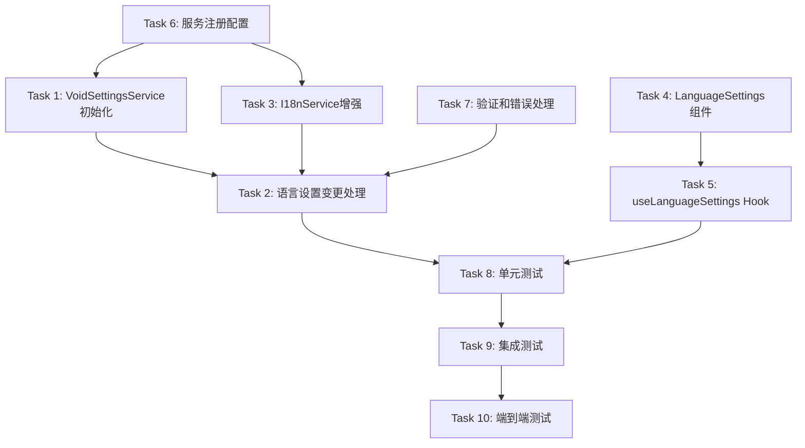

# Language Settings Persistence Fix - Tasks

## Task Overview

本任务列表将指导实施语言设置持久化修复。所有任务基于已批准的需求和设计文档，确保语言设置在应用重启后正确保持。

## Task List

### Task 1: 增强VoidSettingsService的语言初始化逻辑

- [x] **任务1**: 修改VoidSettingsService构造函数，添加I18nService依赖并实现语言初始化

**文件**: `src/vs/workbench/contrib/void/common/voidSettingsService.ts`

**_Prompt**:
- Role: TypeScript后端服务开发者
- Task: 修改VoidSettingsService构造函数，添加I18nService依赖注入，实现从存储中初始化语言设置的逻辑
- Restrictions: 保持现有API兼容性，不破坏其他设置功能
- _Leverage: 现有的依赖注入系统、加密存储机制、事件系统
- _Requirements: AC1, AC4, TR1, TR2
- Success: VoidSettingsService能够在初始化时正确读取并应用保存的语言设置
- Instructions: 首先运行spec-workflow-guide获取工作流指导，然后实施任务。将任务状态从[ ]改为[-]，完成后使用log-implementation工具记录实现细节，然后将状态改为[x]。

### Task 2: 实现语言设置变更的特殊处理机制

- [x] **任务2**: 在VoidSettingsService中添加语言设置变更的特殊处理逻辑

**文件**: `src/vs/workbench/contrib/void/common/voidSettingsService.ts`

**_Prompt**:
- Role: TypeScript服务开发者
- Task: 在setGlobalSetting方法中添加对language参数的特殊处理，包括与I18nService的同步和事件通知
- Restrictions: 必须保持异步操作的一致性，添加错误处理和回滚机制
- _Leverage: 现有的setGlobalSetting方法、事件系统、MetricsService
- _Requirements: AC3, TR2, SR1, NFR2
- Success: 语言设置变更时能够正确同步到I18nService并触发相应事件
- Instructions: 首先运行spec-workflow-guide获取工作流指导，然后实施任务。将任务状态从[ ]改为[-]，完成后使用log-implementation工具记录实现细节，然后将状态改为[x]。

### Task 3: 增强I18nService的语言管理功能

- [x] **任务3**: 扩展I18nService以支持更好的语言状态管理和初始化

**文件**: `src/vs/workbench/contrib/void/common/i18n/i18nService.ts`

**_Prompt**:
- Role: 国际化服务开发者
- Task: 扩展I18nServiceImpl类，添加getCurrentLanguage方法和初始化状态管理，支持从外部设置语言
- Restrictions: 保持现有API兼容性，确保线程安全
- _Leverage: 现有的changeLanguage方法、翻译加载逻辑、事件系统
- _Requirements: AC2, AC4, DR1, DR2
- Success: I18nService能够正确管理语言状态并在初始化时接受外部语言设置
- Instructions: 首先运行spec-workflow-guide获取工作流指导，然后实施任务。将任务状态从[ ]改为[-]，完成后使用log-implementation工具记录实现细节，然后将状态改为[x]。

### Task 4: 更新LanguageSettings React组件的状态同步

- [ ] **任务4**: 修改LanguageSettings组件，添加与后端服务的状态同步和反馈机制

**文件**: `src/vs/workbench/contrib/void/browser/react/src/void-settings-tsx/Settings.tsx`

**_Prompt**:
- Role: React组件开发者
- Task: 更新LanguageSettings组件，添加语言设置变更的事件监听、状态同步和用户反馈机制
- Restrictions: 保持现有UI结构和用户体验，添加适当的加载状态和错误提示
- _Leverage: React Hooks、VoidCustomDropdownBox组件、useI18n hook
- _Requirements: AC2, AC3, UI1, UI2
- Success: LanguageSettings组件能够正确反映当前语言设置并提供即时的用户反馈
- Instructions: 首先运行spec-workflow-guide获取工作流指导，然后实施任务。将任务状态从[ ]改为[-]，完成后使用log-implementation工具记录实现细节，然后将状态改为[x]。

### Task 5: 创建和优化useLanguageSettings Hook

- [ ] **任务5**: 实现useLanguageSettings hook，提供语言设置的状态管理和同步功能

**文件**: `src/vs/workbench/contrib/void/browser/react/src/hooks/useLanguageSettings.ts`

**_Prompt**:
- Role: React Hook开发者
- Task: 创建useLanguageSettings自定义hook，封装语言设置的读取、同步和更新逻辑
- Restrictions: 确保hook的性能和内存效率，避免无限循环渲染
- _Leverage: useI18n hook、useSettingsState hook、依赖注入系统
- _Requirements: AC2, TR3, NFR1
- Success: 提供一个可靠且易于使用的hook来管理语言设置状态
- Instructions: 首先运行spec-workflow-guide获取工作流指导，然后实施任务。将任务状态从[ ]改为[-]，完成后使用log-implementation工具记录实现细节，然后将状态改为[x]。

### Task 6: 更新服务注册和依赖注入配置

- [x] **任务6**: 修改服务注册配置，确保正确的初始化顺序和依赖关系

**文件**: `src/vs/workbench/contrib/void/common/void.contribution.ts`

**_Prompt**:
- Role: 依赖注入配置开发者
- Task: 更新服务注册配置，确保I18nService在VoidSettingsService之前正确初始化，并配置适当的依赖关系
- Restrictions: 必须保持与现有服务注册系统的兼容性，不能影响其他服务的启动
- _Leverage: VS Code的依赖注入系统、现有的服务注册模式
- _Requirements: TR2, NFR1, NFR3
- Success: 服务按照正确的顺序初始化，依赖关系正确配置
- Instructions: 首先运行spec-workflow-guide获取工作流指导，然后实施任务。将任务状态从[ ]改为[-]，完成后使用log-implementation工具记录实现细节，然后将状态改为[x]。

### Task 7: 添加语言设置验证和错误处理

- [x] **任务7**: 实现语言设置的验证逻辑和错误处理机制

**文件**: `src/vs/workbench/contrib/void/common/voidSettingsService.ts`

**_Prompt**:
- Role: 数据验证和错误处理开发者
- Task: 添加语言设置的数据验证函数，实现各种错误场景的处理和恢复策略
- Restrictions: 验证逻辑必须高效，错误处理不能影响用户体验
- _Leverage: 现有的错误处理模式、日志系统、通知服务
- _Requirements: AC4, AC5, DR2, SR1
- Success: 能够正确验证语言设置并在出现错误时优雅恢复
- Instructions: 首先运行spec-workflow-guide获取工作流指导，然后实施任务。将任务状态从[ ]改为[-]，完成后使用log-implementation工具记录实现细节，然后将状态改为[x]。

### Task 8: 编写单元测试

- [ ] **任务8**: 为语言设置功能编写全面的单元测试

**文件**: `test/unit/void/language-settings.test.ts`

**_Prompt**:
- Role: 测试开发者
- Task: 创建comprehensive的单元测试套件，覆盖语言设置的保存、读取、验证和错误处理场景
- Restrictions: 测试必须独立运行，不能依赖外部服务，使用mock对象
- _Leverage: Jest测试框架、现有的测试工具和模式
- _Requirements: T1, NFR2, Success Criteria
- Success: 所有测试通过，代码覆盖率达到95%以上
- Instructions: 首先运行spec-workflow-guide获取工作流指导，然后实施任务。将任务状态从[ ]改为[-]，完成后使用log-implementation工具记录实现细节，然后将状态改为[x]。

### Task 9: 编写集成测试

- [ ] **任务9**: 实现语言设置功能的集成测试

**文件**: `test/integration/void/language-settings.integration.test.ts`

**_Prompt**:
- Role: 集成测试开发者
- Task: 创建集成测试，验证LanguageSettings组件与VoidSettingsService和I18nService的完整交互流程
- Restrictions: 测试必须在接近真实的环境中运行，验证端到端的功能
- _Leverage: VS Code扩展测试环境、现有的集成测试框架
- _Requirements: T2, AC1, AC2, AC3
- Success: 集成测试验证了完整的语言设置持久化流程
- Instructions: 首先运行spec-workflow-guide获取工作流指导，然后实施任务。将任务状态从[ ]改为[-]，完成后使用log-implementation工具记录实现细节，然后将状态改为[x]。

### Task 10: 进行端到端用户测试

- [ ] **任务10**: 执行端到端用户接受测试，验证所有用户场景

**文件**: `test/smoke/void/language-settings.e2e.test.ts`

**_Prompt**:
- Role: 用户接受测试开发者
- Task: 创建端到端测试，模拟真实用户操作，验证语言设置在各种场景下的持久性行为
- Restrictions: 测试必须覆盖所有关键用户路径和边界条件
- _Leverage: Playwright自动化测试、完整的VS Code实例
- _Requirements: T3, Success Criteria, User Requirements
- Success: 所有用户场景测试通过，验证语言设置的完整功能
- Instructions: 首先运行spec-workflow-guide获取工作流指导，然后实施任务。将任务状态从[ ]改为[-]，完成后使用log-implementation工具记录实现细节，然后将状态改为[x]。

## Task Dependencies

## Implementation Notes

### 关键文件路径
- VoidSettingsService: `src/vs/workbench/contrib/void/common/voidSettingsService.ts`
- I18nService: `src/vs/workbench/contrib/void/common/i18n/i18nService.ts`
- LanguageSettings组件: `src/vs/workbench/contrib/void/browser/react/src/void-settings-tsx/Settings.tsx`
- 服务注册: `src/vs/workbench/contrib/void/common/void.contribution.ts`

### 测试文件路径
- 单元测试: `test/unit/void/language-settings.test.ts`
- 集成测试: `test/integration/void/language-settings.integration.test.ts`
- 端到端测试: `test/smoke/void/language-settings.e2e.test.ts`

### 实施顺序建议
1. 首先完成后端服务的改进（任务1-3, 6-7）
2. 然后实现前端组件的更新（任务4-5）
3. 最后进行全面的测试验证（任务8-10）

### 成功标准
- 所有任务完成后，语言设置应该能够：
  - 在用户选择后正确保存到加密存储
  - 在应用重启后自动恢复
  - 在UI中正确显示当前状态
  - 提供即时的用户反馈
  - 处理各种错误场景并优雅恢复

## 风险缓解

### 高风险任务
- **Task 1**: 涉及核心服务修改，需要仔细测试
- **Task 6**: 服务初始化顺序变更，可能影响其他功能

### 缓解策略
- 在实施每个任务前备份相关文件
- 使用分支开发，确保主分支稳定
- 每个任务完成后立即运行相关测试
- 保持小步快跑，频繁提交和验证

这个任务列表为语言设置持久化修复提供了清晰的实施路径，确保每个功能都经过充分的测试和验证。