# Void - AI 代码编辑器项目

> 开源的 Cursor 替代品，基于 VS Code 构建

## 项目愿景

Void 是一个开源的 AI 代码编辑器，旨在为开发者提供智能代码助手功能。项目直接向 LLM 提供商发送消息，不保留用户数据，确保隐私安全。

## 架构总览

Void 基于 VS Code 构建，采用 Electron 架构，包含**主进程**（main process）和**浏览器进程**（browser process）的双进程设计。

### 核心架构特点
- **双进程架构**：Electron 主进程 + 浏览器进程
- **模块化设计**：基于 VS Code 的服务注册系统
- **React UI**：使用 React + TypeScript 构建用户界面
- **多语言支持**：TypeScript 前端，Rust CLI 工具

### 技术栈
- **前端**：React 19, TypeScript, Tailwind CSS
- **构建**：Gulp, Webpack, ESBuild
- **CLI**：Rust (Cargo)
- **AI 集成**：支持 OpenAI, Anthropic, Ollama 等多提供商
- **测试**：Mocha, Playwright

## 模块结构图

```mermaid
graph TD
    A["(根) Void"] --> B["src/vs/workbench/contrib/void"];
    A --> C["cli"];
    A --> D["build"];
    A --> E["test"];
    A --> F["extensions"];

    B --> G["browser"];
    B --> H["common"];
    B --> I["electron-main"];

    G --> J["react"];
    G --> K["services"];
    G --> L["ui-components"];

    J --> M["sidebar-tsx"];
    J --> N["void-settings-tsx"];
    J --> O["markdown"];
    J --> P["quick-edit-tsx"];

    H --> Q["voidSettingsService"];
    H --> R["chatThreadService"];
    H --> S["sendLLMMessageService"];
    H --> T["toolsService"];

    I --> U["sendLLMMessageChannel"];
    I --> V["mcpChannel"];
    I --> W["metricsMainService"];

    C --> X["src/lib.rs"];
    C --> Y["src/main.rs"];

    D --> Z["gulpfile"];
    D --> AA["webpack configs"];

    E --> AB["unit"];
    E --> AC["integration"];
    E --> AD["smoke"];

    F --> AE["package.json"];
    F --> AF["postinstall scripts"];

    click B "./src/vs/workbench/contrib/void/CLAUDE.md" "查看 Void 核心模块文档"
    click C "./cli/CLAUDE.md" "查看 CLI 模块文档"
    click D "./build/CLAUDE.md" "查看构建系统文档"
    click E "./test/CLAUDE.md" "查看测试模块文档"
    click F "./extensions/CLAUDE.md" "查看扩展模块文档"
    click J "./src/vs/workbench/contrib/void/browser/react/CLAUDE.md" "查看 React UI 模块文档"
    click H "./src/vs/workbench/contrib/void/common/CLAUDE.md" "查看通用服务文档"
    click I "./src/vs/workbench/contrib/void/electron-main/CLAUDE.md" "查看主进程服务文档"
```



## 模块索引

| 模块路径 | 职责 | 主要语言 | 关键文件 |
|---------|------|----------|----------|
| `src/vs/workbench/contrib/void/` | Void 核心功能模块 | TypeScript | `voidSettingsService.ts`, `chatThreadService.ts` |
| `src/vs/workbench/contrib/void/browser/` | 浏览器进程组件 | TypeScript + React | `sidebarPane.ts`, `voidSettingsPane.ts` |
| `src/vs/workbench/contrib/void/browser/react/` | React UI 组件 | TypeScript + React | `sidebar-tsx/`, `void-settings-tsx/` |
| `src/vs/workbench/contrib/void/common/` | 跨进程共享服务 | TypeScript | `voidSettingsTypes.ts`, `sendLLMMessageTypes.ts` |
| `src/vs/workbench/contrib/void/electron-main/` | 主进程服务 | TypeScript | `sendLLMMessageChannel.ts`, `mcpChannel.ts` |
| `cli/` | 命令行工具 | Rust | `src/lib.rs`, `src/main.rs` |
| `build/` | 构建配置 | JavaScript + TypeScript | `gulpfile.js`, webpack configs |
| `test/` | 测试套件 | TypeScript + JavaScript | 单元测试、集成测试、冒烟测试 |
| `extensions/` | VS Code 扩展 | TypeScript | 扩展配置和安装脚本 |

## 运行与开发

### 开发环境要求
- Node.js 20.x
- Rust (用于 CLI)
- Git

### 开发命令
```bash
# 安装依赖
npm install

# 构建项目
npm run compile

# 开发模式（监听文件变化）
npm run watch

# 构建 React 组件
npm run buildreact

# 监听 React 组件变化
npm run watchreact

# 运行测试
npm test
# 或者运行特定测试
npm run test-browser
npm run test-node
```

### 构建流程
1. **预安装钩子**：`npm run preinstall`
2. **依赖安装**：`npm install` + `npm run postinstall`
3. **编译**：`npm run compile` (使用 Gulp)
4. **React 构建**：`npm run buildreact` (在 react 目录下)
5. **打包**：使用 Webpack 和 ESBuild 进行代码打包

## 测试策略

### 测试层次
- **单元测试**：`test/unit/` - 使用 Mocha 测试核心服务
- **集成测试**：`test/integration/` - 浏览器和 Electron 集成测试
- **冒烟测试**：`test/smoke/` - 端到端功能测试
- **自动化测试**：`test/automation/` - Playwright 自动化测试

### 测试重点
- Void 核心服务功能
- React UI 组件交互
- LLM 消息发送和接收
- 代码应用（Apply）功能
- 设置管理系统

## 编码规范

### TypeScript/JavaScript
- 使用 ESLint 进行代码检查
- 遵循 VS Code 项目的代码风格
- 使用严格的 TypeScript 配置

### React
- 使用函数组件和 Hooks
- TypeScript 严格模式
- Tailwind CSS 用于样式

### Rust
- 使用 `rustfmt` 进行代码格式化
- 遵循 Rust 官方代码风格指南

## AI 使用指引

### Void 中的 AI 集成
Void 支持多种 LLM 提供商：
- OpenAI (GPT 系列)
- Anthropic (Claude 系列)
- Ollama (本地模型)
- Google (Gemini 系列)
- 自定义提供商

### 关键 AI 功能
- **代码聊天**：侧边栏聊天界面
- **代码应用**：快速应用和慢速应用模式
- **自动完成**：AI 代码补全
- **工具调用**：Edit、Read 等内置工具
- **MCP 集成**：Model Context Protocol 支持

### 开发 AI 功能
- 核心服务位于 `common/` 目录
- UI 组件位于 `browser/react/` 目录
- LLM 消息处理通过 Channel 进行进程间通信

## 变更记录 (Changelog)

### 2025-11-12 16:33:50
- 初始化项目架构文档
- 完成模块结构分析和索引创建
- 生成 Mermaid 架构图和模块文档

---
*本文档由自适应初始化系统生成，基于对 Void 项目代码库的深度分析。*