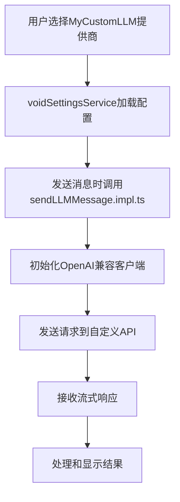

# VOID扩展添加自定义LLM提供商 - 具体代码示例

## 📋 场景假设
假设我们要添加一个名为 `MyCustomLLM` 的自定义提供商，它基于OpenAI兼容API。

---

## 🔧 具体代码修改

### 1. 修改 `voidSettingsTypes.ts`

```typescript
// 文件路径: src/vs/workbench/contrib/void/common/voidSettingsTypes.ts

// 在 displayInfoOfProviderName 函数中添加（约第61行）
if (providerName === 'myCustomLLM') {
    return { title: 'My Custom LLM' }
}

// 在 subTextMdOfProviderName 函数中添加（约第115行）  
if (providerName === 'myCustomLLM') return 'Your custom API documentation link: https://your-docs.com/api'

// 在 displayInfoOfSettingName 函数的apiKey部分添加（约第147行）
placeholder: providerName === 'myCustomLLM' ? 'custom-api-key...' :

// 在 displayInfoOfSettingName 函数的endpoint部分添加（约第178行）
providerName === 'myCustomLLM' ? 'baseURL' :
providerName === 'myCustomLLM' ? 'https://your-api.com/v1'
```

### 2. 修改 `modelCapabilities.ts`

```typescript
// 文件路径: src/vs/workbench/contrib/void/common/modelCapabilities.ts

// 在 defaultModelsOfProvider 对象中添加（约第76行）
myCustomLLM: [
    'custom-model-1',
    'custom-model-2',
],

// 添加自定义提供商的完整配置（约第1275行）
const myCustomLLMSettings: VoidStaticProviderInfo = {
    modelOptions: {
        'custom-model-1': {
            providerName: 'myCustomLLM',
            modelName: 'custom-model-1',
            recognizedModelName: 'custom-model-1',
            supportsSystemMessage: 'system-role',
            specialToolFormat: 'openai-style',
            maxContextLength: 8192,
            supportsStreaming: true,
            supportsFIM: true,
            cost: { input: 0.01, output: 0.02 },
            contextWindow: 8192,
            reservedOutputTokenSpace: 1024,
        },
        'custom-model-2': {
            providerName: 'myCustomLLM',
            modelName: 'custom-model-2',
            recognizedModelName: 'custom-model-2',
            supportsSystemMessage: 'system-role',
            specialToolFormat: 'openai-style',
            maxContextLength: 16384,
            supportsStreaming: true,
            supportsFIM: true,
            cost: { input: 0.02, output: 0.04 },
            contextWindow: 16384,
            reservedOutputTokenSpace: 2048,
        }
    },
    providerReasoningIOSettings: {
        input: {
            includeInPayload: () => null // 自定义推理配置
        },
        output: null,
    },
}

// 在 modelSettingsOfProvider 对象中添加（约第1487行）
myCustomLLM: myCustomLLMSettings,

// 在 modelSettingsOfProvider 的末尾添加类型声明
} as const

// 在文件的最后，确保添加了myCustomLLM到defaultProviderSettings
export const defaultProviderSettings: { [providerName in ProviderName]: any } = {
    // ... 现有配置
    myCustomLLM: {
        endpoint: 'https://your-api.com/v1',
        apiKey: '',
        _didFillInProviderSettings: false,
    },
}
```

### 3. 修改 `voidSettingsService.ts`

```typescript
// 文件路径: src/vs/workbench/contrib/void/common/voidSettingsService.ts

// 在 getState 函数的返回对象中添加（约第329行）
myCustomLLM: {
    ...defaultProviderSettings.myCustomLLM,
    ...modelInfoOfDefaultModelNames(defaultModelsOfProvider.myCustomLLM),
},
```

### 4. 修改 `sendLLMMessage.impl.ts`（如果需要特殊处理）

```typescript
// 文件路径: src/vs/workbench/contrib/void/electron-main/llmMessage/sendLLMMessage.impl.ts

// 在 newOpenAICompatibleSDK 函数中添加（约第165行）
else if (providerName === 'myCustomLLM') {
    // 使用OpenAI兼容的客户端初始化逻辑
    const baseURL = thisConfig.endpoint || 'https://your-api.com/v1'
    const apiKey = thisConfig.apiKey
    
    // 如果需要特殊的headers或其他配置
    const customHeaders = thisConfig.headersJSON ? JSON.parse(thisConfig.headersJSON) : {}
    
    const client = new OpenAI({ 
        baseURL, 
        apiKey, 
        defaultHeaders: customHeaders,
        ...commonPayloadOpts 
    })
    
    return client
}
```

### 5. 添加默认设置配置（如果需要）

在 `modelCapabilities.ts` 中添加默认提供商设置：

```typescript
// 在文件顶部的 defaultProviderSettings 定义中添加
const defaultProviderSettings = {
    // ... 现有提供商
    myCustomLLM: {
        endpoint: 'https://your-api.com/v1',
        apiKey: '',
        _didFillInProviderSettings: false,
    },
} as const
```

---

## 🧪 测试配置

### 1. 创建测试文件

```typescript
// tests/test-custom-provider.ts
import { MyCustomLLMSettings } from '../src/vs/workbench/contrib/void/common/voidSettingsTypes'

const testMyCustomLLMConnection = async () => {
    const settings = {
        endpoint: 'https://your-api.com/v1',
        apiKey: 'test-api-key',
        _didFillInProviderSettings: true,
    }
    
    try {
        // 测试模型列表获取
        const response = await fetch(`${settings.endpoint}/models`, {
            headers: {
                'Authorization': `Bearer ${settings.apiKey}`,
                'Content-Type': 'application/json'
            }
        })
        
        if (response.ok) {
            console.log('✅ MyCustomLLM connection successful')
            return true
        } else {
            console.error('❌ Connection failed:', response.statusText)
            return false
        }
    } catch (error) {
        console.error('❌ Connection error:', error)
        return false
    }
}

// 测试聊天功能
const testMyCustomLLMChat = async () => {
    const settings = {
        endpoint: 'https://your-api.com/v1',
        apiKey: 'test-api-key',
    }
    
    const response = await fetch(`${settings.endpoint}/chat/completions`, {
        method: 'POST',
        headers: {
            'Authorization': `Bearer ${settings.apiKey}`,
            'Content-Type': 'application/json'
        },
        body: JSON.stringify({
            model: 'custom-model-1',
            messages: [
                { role: 'user', content: 'Hello, this is a test message.' }
            ],
            max_tokens: 100
        })
    })
    
    return response.ok
}
```

---

## 🚀 使用示例

### 在VOID中使用自定义提供商

1. **启动VOID扩展**
2. **打开设置** → Extensions → Void → Settings
3. **选择提供商**: 在Provider下拉列表中选择 "My Custom LLM"
4. **配置设置**:
   - **API Key**: 输入您的API密钥
   - **Endpoint**: 设置为 `https://your-api.com/v1`
5. **选择模型**: 选择 "custom-model-1" 或 "custom-model-2"
6. **测试连接**: 点击 "Test Connection" 验证配置
7. **开始使用**: 在聊天中使用自定义LLM

---

## 📝 完整工作流程



---

## ⚠️ 注意事项

1. **API兼容性**: 确保您的自定义API与OpenAI格式兼容
2. **错误处理**: 添加适当的错误处理和用户友好的错误信息
3. **测试**: 在不同网络条件下测试连接稳定性
4. **安全性**: 不要硬编码API密钥，使用环境变量
5. **文档**: 为用户提供清晰的配置和使用文档

---

## 🔍 调试技巧

1. **使用浏览器开发者工具**: 查看网络请求
2. **检查控制台日志**: 寻找错误信息
3. **验证API格式**: 确保请求/响应格式正确
4. **逐步测试**: 先测试基础连接，再测试高级功能

---

## 📈 扩展功能

添加更多高级功能：

```typescript
// 支持自定义参数
if (providerName === 'myCustomLLM') {
    return {
        ...new OpenAI({ baseURL, apiKey, defaultHeaders }),
        // 添加自定义方法
        getCustomFeatures: () => ({ temperature: 0.7, topP: 0.9 }),
    }
}
```

这样，您就成功地在VOID扩展中添加了一个自定义LLM提供商！